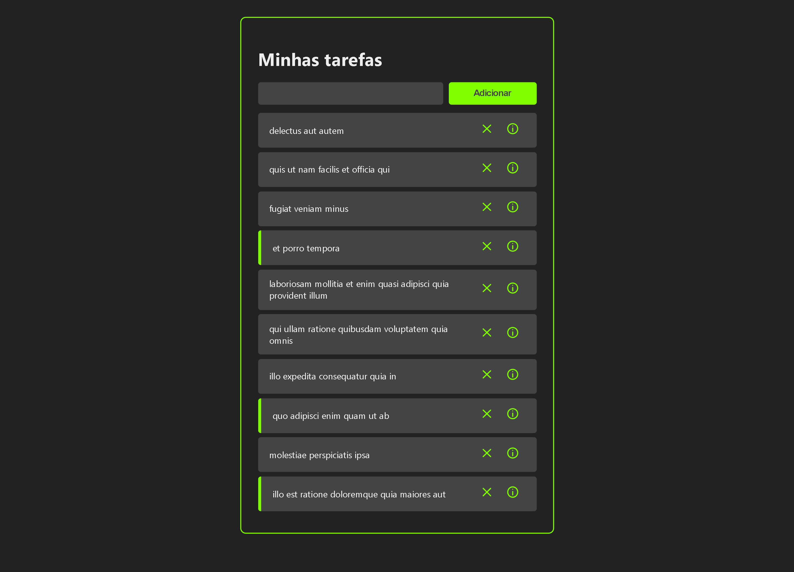

# Curso de React

## Índice
* [Introdução](#%EF%B8%8F-introdução)
* [Tecnologias utilizadas](#%EF%B8%8F-tecnologias-utilizadas)
* [Ferramentas utilizadas](#%EF%B8%8F-ferramentas-utilizadas)
* [Serviços utilizados](#-serviços-utilizados)
* [Funcionalidades do projeto](#-funcionalidades-do-projeto)
* [Acesso ao projeto](#-acesso-ao-projeto)
* [Autor](#-autor)
* [Contato](#%EF%B8%8F-contato)

## ⚙️ Introdução 

Projeto desenvolvido através de um curso on-line disponível no youtube. O projeto funciona como um site de gestão de atividades funcional que possibilita a inserção e exclusão de uma atividade, além de possibilitar visualizar mais informações sobre as tarefas.

## 🖥️ Tecnologias utilizadas

- ``React JS``
- ``React Router Dom``
- ``React Icons``
- ``React Axios``

## 🛠️ Ferramentas utilizadas

- ``Visual Studio Code``

## 🧰 Serviços utilizados

- ``Github``

## 🪚 Funcionalidades do projeto

- ``Funcionalidade 1:`` Criar uma nova tarefa
- ``Funcionalidade 2:`` Ver os detalhes uma tarefa
- ``Funcionalidade 3:`` Deletar uma tarefa
- ``Funcionalidade 4:`` Marcar uma tarefa como concluída ao clicar nela

## 📂 Acesso ao projeto

Você pode acessar o projeto [via link](https://curso-react.gustavoborges8.repl.co/) ou [baixar o projeto](https://github.com/gustavotht21/curso-react/archive/refs/heads/main.zip) e iniciá-lo na IDE de sua preferência, onde quando executado irá abrir no navegador o projeto funcionando

## 👤 Autor

| [ Gustavo Casagrande Borges](https://github.com/gustavotht21) |  
| :---: | 

## ✉️ Contato

Entre em contato via e-mail: borges.gustavo@estudante.ifro.edu.br
